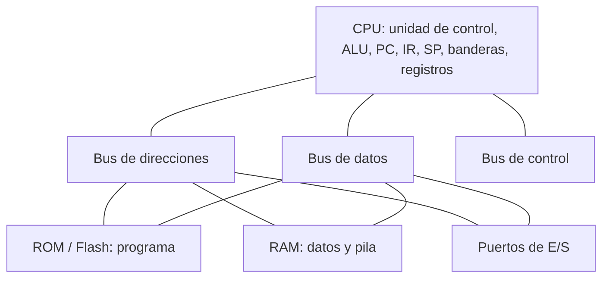

# Guía de repaso: Arquitectura de Computadoras

Esta guía cubre **los 22 temas** que aparecieron en los 9 exámenes (95 preguntas), sin saltarme ninguno, aunque haya salido en una sola pregunta. Al final hay una **tabla con la cantidad de preguntas por tema**.

**Cómo usarla**
- Cada tema tiene lo que debes saber, fórmulas o tablas, y las **respuestas modelo** a las preguntas donde salió. Los códigos (A1, C7, G12...) son los del documento de preguntas transcritas.
- Las respuestas de los exámenes **C** vienen de la clave del profesor que aparece en las capturas. Las demás las armé yo con los datos técnicos de cada arquitectura.
- Donde algo depende de cómo lo vieron en clase o hay una discrepancia, lo marqué con **⚠ Verifica**. Contrástalo con tus apuntes y presentaciones.

---

## Índice de temas

1. Conceptos básicos y modelo de una computadora
2. Von Neumann y Harvard
3. Tipos de arquitectura según dónde están los operandos
4. La pila (Stack)
5. El contador de programa (PC) y los saltos
6. Arranque y reset
7. Interrupciones
8. Subrutinas y marco de pila
9. Modos de direccionamiento
10. Ensamblador de microcontroladores (AVR, PIC18, ARM)
11. Ensamblador x86 en sintaxis AT&T (Pentium)
12. Intel x86: segmentación y modo real
13. CISC vs RISC y comparación de familias
14. Niveles de privilegio
15. Entrada/salida, puertos y espacios de direcciones
16. Organización de la memoria en microcontroladores (mapas, bancos, caché)
17. Alineación de datos
18. Cálculo de memoria, buses y direcciones
19. Representación numérica y banderas
20. Tiempo de ejecución
21. Formato de instrucción y microprocesador virtual
22. Ortogonalidad

---

## 1. Conceptos básicos y modelo de una computadora
**Salió en:** A9, B10, D10, E6, F8, G14, G15, H6 (8 preguntas)

**Lo que debes saber**
- **Arquitectura de computadoras:** conjunto de atributos del sistema que ve el programador: conjunto de instrucciones (ISA), registros, modos de direccionamiento, tipos de datos, organización de memoria, manejo de E/S e interrupciones. La *organización* es cómo se implementa por dentro.
- **Elementos de una computadora:** CPU (unidad de control, ALU, registros como PC, IR, SP, banderas y propósito general), memoria (RAM de datos, ROM/Flash de programa), **buses** (datos, direcciones, control), puertos de E/S y reloj.
- **Microprocesador vs microcontrolador:** el microprocesador es solo la CPU, necesita memoria y periféricos externos (Pentium, 80286). El microcontrolador integra CPU, memoria Flash/RAM y periféricos (puertos, timers, ADC) en un solo chip (ATmega328P, PIC18F4550, TM4C1294NCPDT, STM32F103C8).
- **"Procesador de N bits":** el tamaño de sus registros internos y de la ALU, o sea con cuántos bits opera de una vez. Suele coincidir con el ancho de palabra.
- **Resolución:** unidad mínima direccionable de memoria (en casi todos, 1 byte = 8 bits).



**Regla para dibujar la computadora (D10, H6):** los números deben ser consistentes. Si la RAM es de 4 KB organizada en bytes, el bus de direcciones tiene 12 líneas; si los registros son de 8 bits, el bus de datos es de 8 líneas. El PC debe tener tantos bits como líneas de dirección de la memoria de programa.

**Respuestas modelo**
- **A9 / B10:** que sus registros internos y su ALU trabajan con operandos de 16 bits (el ancho de palabra es de 16 bits).
- **E6:** el conjunto de características del computador visibles al programador (ISA, registros, direccionamiento, memoria, E/S), distinto de su implementación física.
- **F8:** la cantidad mínima de memoria a la que se puede acceder con una instrucción (la unidad direccionable, normalmente 1 byte).
- **G14:** ancho de palabra y de buses, conjunto y formato de instrucciones, registros (PC, SP, banderas), modos de direccionamiento, organización de memoria (Von Neumann o Harvard, endianness, alineación), manejo de pila, interrupciones y vectores, E/S y niveles de privilegio.
- **G15:** el microprocesador es solo la CPU y necesita chips externos; el microcontrolador trae CPU, memoria y periféricos en un mismo chip. (No es solo "el espacio donde se encuentran".)
- **D10 / H6:** el diagrama de arriba, con anchos de bus consistentes.

---

## 2. Von Neumann y Harvard
**Salió en:** D1, E7, E8 (3)

- **Von Neumann:** una sola memoria y un solo bus para instrucciones y datos. Es secuencial (en la clasificación de Flynn es SISD: una instrucción, un dato). Ejemplos: x86 y el modelo de memoria unificado de ARM. Desventaja: el cuello de botella de Von Neumann (instrucción y dato no se leen a la vez).
- **Harvard:** memorias y buses **separados** para programa y datos, así que se pueden leer instrucción y dato en el mismo ciclo, y pueden tener anchos distintos (instrucción de 16 bits, dato de 8). Ejemplos: ATmega328P y PIC18F4550.

**Respuestas modelo**
- **D1:** el **contador de programa (PC)**. ⚠ Verifica: lo más probable es que pida el PC, porque en SISD hay un solo flujo de instrucciones.
- **E7:** arquitectura donde instrucciones y datos comparten la misma memoria y el mismo bus.
- **E8:** arquitectura con memoria de programa y memoria de datos separadas, cada una con su bus.

---

## 3. Tipos de arquitectura según dónde están los operandos
**Salió en:** A7, C2, D2, F2, F9 (5)

| Tipo | Dónde están los operandos | Ejemplo |
|---|---|---|
| **Pila** | implícitos en la cima de la pila (los dos últimos elementos); instrucciones sin operandos | `PUSH A`, `ADD` |
| **Acumulador** | un operando implícito es el acumulador, el otro está en memoria | `ADD B` (ACC ← ACC + B). PIC usa el registro W |
| **Registros de propósito general** | en registros (o registro y memoria) | x86, ARM, AVR |
| **Carga/almacenamiento (load/store)** | solo `LOAD`/`STORE` acceden a memoria; las operaciones aritméticas son solo entre registros | ARM, AVR (RISC) |

**C = A + B en cada arquitectura (F9)**

| Pila | Acumulador | Registros (reg-reg, load/store) |
|---|---|---|
| `PUSH A` | `LOAD A` | `LOAD R1, A` |
| `PUSH B` | `ADD B` | `LOAD R2, B` |
| `ADD` | `STORE C` | `ADD R3, R1, R2` |
| `POP C` | | `STORE C, R3` |

**Respuestas modelo**
- **A7:** una arquitectura donde una de las fuentes y el destino de las operaciones es siempre un registro especial, el acumulador.
- **C2:** son computadoras que hacen las operaciones sobre una pila, con los dos últimos elementos de la pila (clave del profesor).
- **D2:** *ventaja:* instrucciones simples y de longitud fija, decodificación fácil y mejor pipeline. *Desventaja:* se necesitan más instrucciones (más código) porque hay que cargar y guardar explícitamente.
- **F2:** pila: en la pila; acumulador: en el acumulador y en memoria; registros de propósito general: en los registros.

---

## 4. La pila (Stack)
**Salió en:** A2, B2, E5, F4, G1, G5, H9, I9 (8)

**Lo que debes saber**
- La pila es memoria **LIFO**. El **puntero de pila (SP)** apunta a su cima. En Intel, AVR y ARM crece hacia direcciones menores.
- **Función principal:** guardar las direcciones de retorno de subrutinas e interrupciones; además parámetros, variables locales y registros guardados.
- Para poder apuntar a cualquier posición de memoria, el SP necesita **al menos tantos bits como el bus de direcciones**.

| | ATmega328P | PIC18F4550 | STM32F103C8 / TM4C1294 |
|---|---|---|---|
| Dónde está | en la SRAM (0x0100 a 0x08FF) | pila de **hardware** aparte de la RAM | en la RAM |
| Puntero | SPH:SPL, par de 8 bits; se usan **12 bits** | STKPTR de **5 bits** | SP de **32 bits** |
| Tamaño de cada entrada | 1 byte (un `CALL` guarda 2 bytes) | **21 bits** (guarda un PC) | 4 bytes |
| Profundidad | limitada por la SRAM | 31 niveles | limitada por la RAM |
| Valor inicial | RAMEND = **0x08FF** | STKPTR = 0 (pila vacía) | primera palabra de la tabla de vectores (típico 0x20005000 en STM32F103C8 y 0x20040000 en TM4C1294) |

**Respuestas modelo**
- **A2 / H9 / I9:** guardar las direcciones de retorno (de subrutinas e interrupciones), y también parámetros, variables locales y registros que se deben preservar.
- **B2:** **24 bits** (debe poder apuntar a toda la memoria de 24 líneas de dirección).
- **E5:** ATmega328P: SP = RAMEND (0x08FF), el último byte de la SRAM. PIC18F4550: STKPTR = 0, pila vacía. TM4C1294NCPDT: el SP se carga con el valor de la dirección 0x00000000 (primera entrada de la tabla de vectores).
- **F4:** ATmega328P: apunta a RAMEND tras el reset; en programas en ensamblador se suele inicializar a mano: `LDI R16,HIGH(RAMEND)` → `OUT SPH,R16`, y lo mismo con LOW → SPL. STM32F103C8: el hardware carga el SP automáticamente con la primera palabra de la tabla de vectores. ⚠ Verifica cómo lo vieron en clase para el ATmega.
- **G1:** ATmega328P: 12 bits efectivos (registro par SPH:SPL de 16 bits). PIC18F4550: STKPTR de 5 bits. STM32F103C8: 32 bits.
- **G5:** ATmega328P: entradas de 1 byte (8 bits); PIC18F4550: entradas de 21 bits; STM32F103C8: entradas de 32 bits.

---

## 5. El contador de programa (PC) y los saltos
**Salió en:** A1, C10, D5, F3, G2, H10 (6)

- El **PC** contiene la dirección de la siguiente instrucción que se va a ejecutar (la clave del profesor lo describe como el registro que indica la instrucción que se ejecuta). Después de buscar (fetch) la instrucción, el PC se incrementa según su tamaño.
- **Tipos de saltos respecto al PC: 2.**
  1. **Absoluto:** el PC se carga con una dirección específica (`JMP`, `GOTO`, `CALL`).
  2. **Relativo:** al PC se le suma una constante (`RJMP`, `BRA`, `BEQ`).
  Cada uno puede ser condicional o incondicional.
- **Incremento del PC:**
  - **ATmega328P:** el PC cuenta **palabras** de 16 bits, así que se incrementa en **1** (instrucción de 16 bits) o **2** (instrucciones de 32 bits como `JMP`, `CALL`, `LDS`, `STS`).
  - **PIC18F4550:** la memoria de programa está organizada en **bytes**, así que el PC se incrementa en **2** (instrucción de 16 bits) o **4** (instrucción de 32 bits). Siempre vale un número par (su bit 0 es 0).

**Respuestas modelo**
- **A1 / F3:** dos tipos: salto absoluto (PC ← dirección específica) y salto relativo (PC ← PC + constante), cada uno condicional o incondicional.
- **C10 / H10:** indica la dirección de la instrucción que se está ejecutando o que se va a ejecutar a continuación.
- **D5:** como la memoria es de bytes y las instrucciones miden 2 o 4 bytes, el PC siempre va de 2 en 2 (o de 4 en 4): vale direcciones pares y su bit menos significativo es siempre 0.
- **G2:** ATmega328P: +1 o +2 (palabras). PIC18F4550: +2 o +4 (bytes).

---

## 6. Arranque y reset
**Salió en:** B7, C5, F7, I2 (4)

**Qué pasa al prender (clave del profesor, C5):**
1. El PC se carga con una dirección de memoria (la del reset).
2. Se lee la instrucción de esa dirección.
3. Se ejecuta la instrucción.
4. Se incrementa el PC y apunta a la siguiente instrucción.
5. Se repite desde el paso 2.

| | PC inicial | SP inicial |
|---|---|---|
| ATmega328P | 0x0000 (el primer vector es el Reset) | RAMEND (conviene inicializarlo) |
| PIC18F4550 | 0x0000 | STKPTR = 0 |
| STM32F103C8 / TM4C | el hardware lee la dirección del *Reset handler* de la palabra en **0x00000004** | el hardware lee el valor de la palabra en **0x00000000** |

**Respuestas modelo**
- **B7 / C5:** los 5 pasos de arriba.
- **F7:** en el ATmega328P la primera posición de memoria es el vector de Reset, así que solo se empieza a ejecutar desde ahí. En el STM32 la tabla de vectores empieza con el valor inicial del SP y luego el Reset handler, por lo que esa tabla debe estar bien armada antes de arrancar.
- **I2:** el PC se carga con la dirección del Reset handler, que está en la palabra de la tabla de vectores ubicada en 0x00000004 (no con 0x00).

---

## 7. Interrupciones
**Salió en:** C7, C8, E1, G4, G7 (5)

**Pasos cuando ocurre una interrupción en el TM4C1294NCPDT (clave del profesor, C8)**
1. Se suspende la ejecución del programa en curso.
2. Se carga el registro LR con la dirección de retorno.
3. Se carga el PC con la dirección del vector de interrupciones.
4. Se salta a la dirección correspondiente.
5. Se ejecuta el servicio.
6. Se borra la bandera de interrupción.
7. Se retorna de la interrupción.

*(Nota técnica: en la práctica el Cortex-M apila automáticamente R0 a R3, R12, LR, PC y xPSR; la clave del profesor lo simplifica a esos 7 pasos.)*

**Subrutina vs interrupción (clave del profesor, C7)**

| Subrutina | Interrupción |
|---|---|
| El PC se carga con la dirección de la subrutina | El PC se carga con la dirección del vector de interrupciones |
| Ocurre cuando el programador la invoca | Ocurre cuando sucede el evento |
| Se retorna con instrucción de retorno | Se retorna con retorno de interrupción |

**Vectores de reset e interrupción**

| | Dónde inicia la tabla |
|---|---|
| ATmega328P | 0x0000 (Reset), INT0 en 0x0002, INT1 en 0x0004 |
| PIC18F4550 | Reset 0x0000, prioridad **alta 0x0008**, prioridad **baja 0x0018** |
| STM32F103C8 | 0x00000000 (SP inicial), Reset en 0x00000004; las IRQ externas desde 0x00000040 |

**Respuestas modelo**
- **E1:** el PC se carga con **0x0018** (vector de prioridad baja del PIC18F4550).
- **G4:** ATmega328P: 0x0000; PIC18F4550: 0x0000 (reset), 0x0008 (alta) y 0x0018 (baja); STM32F103C8: 0x00000000.
- **G7 (pasos para INT0 del ATmega328P):**
  1. Inicializar la pila y poner el vector de INT0 en 0x0002 (un salto a la rutina).
  2. Configurar PD2 como entrada (opcional, pull-up).
  3. Elegir el tipo de disparo en `EICRA` (bits ISC01:ISC00: `00` nivel bajo, `01` cualquier cambio, `10` flanco de bajada, `11` flanco de subida).
  4. Habilitar INT0 en `EIMSK`.
  5. Habilitar interrupciones globales con `SEI` (bit I de SREG).
  6. Escribir la rutina de servicio y terminarla con `RETI`.

```asm
.org 0x0000
    rjmp RESET
.org 0x0002
    rjmp INT0_ISR
RESET:
    ldi  r16, high(RAMEND)
    out  SPH, r16
    ldi  r16, low(RAMEND)
    out  SPL, r16
    cbi  DDRD, 2            ; PD2 como entrada
    sbi  PORTD, 2           ; pull-up
    ldi  r16, (1<<ISC01)    ; flanco de bajada
    sts  EICRA, r16         ; EICRA está en I/O extendido: se usa STS
    ldi  r16, (1<<INT0)
    out  EIMSK, r16
    sei
main: rjmp main
INT0_ISR:
    ; ... servicio ...
    reti
```

---

## 8. Subrutinas y marco de pila
**Salió en:** B5, D3, D8, F6, I4 (5)

**Qué ocurre al llamar una subrutina (D8)**
1. Se ejecuta `CALL` (la instrucción ya fue leída y el PC apunta a la siguiente).
2. Se **guarda la dirección de retorno**: en la pila (ATmega, Intel), en la pila de hardware (PIC) o en el registro LR (ARM, instrucción `BL`).
3. El PC se carga con la dirección de la subrutina.
4. Se ejecuta la subrutina (puede guardar registros, crear su marco de pila y usar variables locales).
5. Con `RET` se recupera la dirección de retorno al PC y se continúa después del `CALL`.

**Diferencia ATmega328P vs STM32F103C8 (F6):** en el ATmega la dirección de retorno la guarda automáticamente el hardware en la pila (SRAM). En el STM32 `BL` la deja en el registro **LR**, sin tocar la pila; si la subrutina llama a otra, debe guardar LR (`PUSH {LR}`) y recuperarlo después (`POP {PC}`).

**Intel**
- **D3:** `call` guarda la dirección de la instrucción siguiente. La instrucción mide 3 bytes (E9 + 2 bytes), así que el PC pasa de 338CH a 338CH + 3 = **338FH**, y ese valor es el que se mete en la pila. ⚠ Verifica: en x86 real el opcode de `CALL` near es E8 (E9 es `JMP`), pero la lógica de la respuesta es la misma.
- **I4:** un `ret` lejano (`RETF`) saca de la pila el **IP** y luego el **CS** (4 bytes), y SP aumenta en 4. Un `ret` cercano solo saca el IP.

**B5: pila de `sum(a,b,c,d)` (32 bits, la pila crece hacia abajo, cima = 00001000H)**
Se empujan los parámetros de derecha a izquierda (convención `cdecl`) y luego la dirección de retorno:

| Dirección | Contenido |
|---|---|
| 00001000H | (cima antes de llamar) |
| 00000FFCH | d |
| 00000FF8H | c |
| 00000FF4H | b |
| 00000FF0H | a |
| 00000FECH | dirección de retorno ← **SP** |

Si la función arma su marco con `push ebp`, el EBP guardado queda en 00000FE8H.

---

## 9. Modos de direccionamiento
**Salió en:** A10, B4, B9, C3, D6, E2, F10, I7 (8)

| Modo | Dónde está el dato | Ejemplo |
|---|---|---|
| **Inmediato** | en la propia instrucción | `LDI R16,0x25`, `MOVLW 0x30`, `MOV AX,5` |
| **Directo** | la instrucción trae la dirección del dato | `LDS R16,0x0100`, `MOVWF 0x25` |
| **Indirecto por registro** | un registro contiene la dirección del dato (un *apuntador*) | `LD R16,X`, `MOVWF INDF0`, `LDR R0,[R1]`, `MOV AX,[BX]` |

**Respuestas modelo**
- **B9:** el dato es una constante que va escrita dentro de la propia instrucción.
- **C3:** PIC18F4550 tiene **directo** (la instrucción trae la dirección del dato en memoria) e **indirecto** (por medio de un registro FSR que contiene la dirección del dato, se accede al dato con INDF).
- **A10:** la RAM de datos del PIC18 es de 12 bits de dirección (16 bancos de 256 bytes). 0xABC = banco 0xA, desplazamiento 0xBC.
  ```asm
  ; Directo
  MOVLB 0x0A            ; selecciona el banco A
  MOVWF 0xBC, BANKED    ; escribe W en banco A, offset BC

  ; Indirecto
  LFSR  0, 0x0ABC       ; FSR0 = 0x0ABC
  MOVWF INDF0           ; escribe W en la dirección que apunta FSR0
  ```
- **D6:** `LDI R16,0x100` carga la **constante** 0x100 en R16 (direccionamiento inmediato; además un valor de 9 bits no cabe en el campo de 8 bits de LDI, así que es inválida), mientras `LDS R16,0x100` carga en R16 el **contenido** de la dirección de RAM 0x100 (direccionamiento directo).
- **E2:** las instrucciones de ARM miden 32 bits (16 o 32 en Thumb-2), y una dirección completa de 32 bits no cabe en la instrucción junto con el opcode. Por eso se carga la dirección en un registro y se accede de forma indirecta: `LDR R1,=0x20000010` y luego `LDR R0,[R1]`.
- **F10:** en el STM32F103C8: **inmediato sí** (`MOVS R0,#255`, `MOVW R0,#0x1234`, `MOVT`). **Directo no**, por la misma razón que E2: no se puede meter una dirección de 32 bits en la instrucción; se usa un registro como apuntador.
- **B4 / I7:** un apuntador es un registro que contiene la dirección del dato. Para el último byte de memoria, se carga la última dirección en el registro y se accede con indirecto por registro. Para I7 (32 líneas de dirección, última dirección 0xFFFFFFFF), en sintaxis AT&T: `movl $0xFFFFFFFF, %esi` seguido de `movb (%esi), %al`. Para B4 (24 líneas, última dirección 0xFFFFFF) es el mismo patrón con ese valor.

---

## 10. Ensamblador de microcontroladores (AVR, PIC18, ARM)
**Salió en:** A4, C9, E3, G10, H5, H8 (6)

**Reglas de inmediatos**
- **AVR:** `LDI Rd,K` solo funciona con R16 a R31 y K de 8 bits (0 a 255).
- **PIC18:** `MOVLW k` carga un literal de **8 bits** en W (0x00 a 0xFF).
- **ARM Thumb-2 (Cortex-M):** `MOVW Rd,#imm16` carga 16 bits (pone en cero los altos); `MOVT Rd,#imm16` escribe los 16 bits **altos** y deja intactos los bajos; `LDR Rd,=const` carga cualquier constante de 32 bits desde un *literal pool*.

**A4: escribir 100 localidades con 0x00 desde la dirección de RAM más baja**
- ATmega328P: la SRAM empieza en 0x0100.
  ```asm
  ldi  XH, 0x01
  ldi  XL, 0x00        ; X = 0x0100
  ldi  r16, 100        ; contador
  clr  r17             ; valor 0x00
  lazo: st X+, r17     ; escribe y avanza
        dec r16
        brne lazo
  ```
- PIC18F4550: la RAM empieza en 0x000 (así que el contador no puede estar en RAM; se usa FSR0L como contador).
  ```asm
  LFSR  0, 0x000
  lazo: CLRF POSTINC0     ; escribe 0 y avanza
        MOVLW d'100'
        CPFSEQ FSR0L      ; salta si FSR0L == 100
        BRA   lazo
  ```
- TM4C1294NCPDT: la SRAM empieza en 0x20000000.
  ```asm
  LDR  R0, =0x20000000
  MOV  R1, #100
  MOV  R2, #0
  lazo: STRB R2, [R0], #1
        SUBS R1, R1, #1
        BNE  lazo
  ```

**Respuestas modelo**
- **C9 (clave del profesor):**
  - `MOVLW 0x200`: incorrecto, el valor no cabe en el literal de la instrucción. (La clave dice "más de 16 bits"; el literal de MOVLW es de 8 bits. ⚠ Verifica.)
  - `MOV R0,#0x20000000`: incorrecto según la clave, es un valor de 32 bits. ⚠ Verifica: en ARM real este valor sí se puede codificar (un byte rotado). Si el profesor es el mismo, contesta como en la clave.
  - `MOV AX,EBX`: incorrecto, mueve 32 bits a un registro de 16 bits (tamaños distintos).
- **E3 (mover 0x4590 a un registro):**
  - ATmega328P (registros de 8 bits, se usan dos): `LDI R17,0x45` y `LDI R16,0x90`.
  - PIC18F4550: `MOVLW 0x45` → `MOVWF REGH`, `MOVLW 0x90` → `MOVWF REGL` (o `LFSR 0,0x590` si solo se necesitan 12 bits).
  - TM4C1294NCPDT: `MOVW R0,#0x4590` (o `LDR R0,=0x4590`).
- **G10 (mover 16 bits desde 0x20000000 a R5 del STM32F103C8):** `LDR R0,=0x20000000` y luego `LDRH R5,[R0]`.
- **H5 (tres maneras de cargar la constante en R1):** (1) `MOVW R1,#0x0000` + `MOVT R1,#0x2000` (o la macro `MOV32 R1,#0x20000000`); (2) `LDR R1,=0x20000000`; (3) `MOV R1,#0x20000000` si el ensamblador la puede codificar. (El examen escribe 0x2000000, con un cero menos; el procedimiento es el mismo.)
- **H8:** `MOVT R3,#0xF123` escribe 0xF123 en los **16 bits altos** de R3 (bits 31 a 16) y deja intactos los 16 bajos. Si R3 era 0x0000ABCD queda 0xF123ABCD.

---

## 11. Ensamblador x86 en sintaxis AT&T (Pentium)
**Salió en:** D7, G12, I5, I10 (4)

**Reglas de la sintaxis AT&T:** `operación origen, destino` (el orden contrario al de Intel). Los registros llevan `%`, las constantes `$`, y la memoria se escribe `desplazamiento(base)`. Los sufijos indican el tamaño: `b` = 8 bits, `w` = 16, `l` = 32, `q` = 64.

**Respuestas modelo**
- **D7a** `movl -8(%rbp), %esi`: copia los 32 bits que están en memoria en la dirección RBP − 8 al registro ESI.
- **D7b** `leaq -20(%rbp), %rsi`: *Load Effective Address*; calcula RBP − 20 y deja esa **dirección** en RSI (no lee la memoria).
- **I5** `movl %eax, -4(%rbp)`: copia el valor de 32 bits de EAX a la memoria en la dirección RBP − 4 (típicamente una variable local). Origen = %eax, destino = −4(%rbp).
- **I10** `pushq %rbp`: resta 8 a RSP y guarda en esa posición los 64 bits de RBP (se guarda el puntero base de la función que llamó, es parte del prólogo `pushq %rbp` / `movq %rsp,%rbp`).
- **G12:** **ESP** (puntero de pila) y **EBP** (puntero base del marco); en 64 bits, RSP y RBP.

---

## 12. Intel x86: segmentación y modo real
**Salió en:** C1, H1, H2 (3)

- En modo real del 8086: **dirección física = segmento × 16 + desplazamiento** (el segmento se corre un dígito hexadecimal a la izquierda). Bus de direcciones de 20 bits (1 MB), bus de datos de 16 bits.
- **Dirección lógica** = `segmento:desplazamiento`. **Dirección efectiva** = el desplazamiento.
- **Segmentos:** CS (código), DS (datos), SS (pila), ES (extra), y desde el 80386 también FS y GS.
- **80286:** bus de datos de 16 bits y de direcciones de 24 bits (16 MB).

**Respuestas modelo**
- **C1 (clave del profesor):** a) física = 0x0020 × 16 + 0x00FF = 0x00200 + 0x000FF = **0x002FF**; b) efectiva = **0x00FF**; c) lógica = **0x0020:0x00FF**.
- **H1:** 16 bits.
- **H2:** hasta 6 segmentos: código (CS), datos (DS), pila (SS) y datos extra (ES, FS, GS).

---

## 13. CISC vs RISC y comparación de familias
**Salió en:** G13 (1)

| | Pentium (x86) | ARM |
|---|---|---|
| Tipo | CISC | RISC |
| Longitud de instrucción | variable (1 a 15 bytes) | fija (32 bits, o 16/32 en Thumb-2) |
| Acceso a memoria | las instrucciones pueden operar directo con memoria | load/store: solo `LDR`/`STR` acceden a memoria |
| Registros | pocos de propósito general (8 en 32 bits, 16 en 64) | 16 o más, más uniformes |
| Niveles de privilegio | 4 anillos | 2 |
| Sintaxis/ensamblador | AT&T o Intel | propia de ARM |

**G13:** CISC vs RISC; instrucciones de longitud variable vs fija; Pentium opera con memoria directamente mientras ARM es de carga/almacenamiento.

---

## 14. Niveles de privilegio
**Salió en:** C4 (1)

- **Intel:** **4** niveles (anillos 0, 1, 2, 3 → códigos 00, 01, 10, 11). El sistema operativo es el único en el nivel 0.
- **ARM:** **2** niveles (0, 1) según la clave del profesor.
- **C4 (clave):** ARM tiene 2 (0, 1); Intel tiene 4 (00, 01, 10, 11).

---

## 15. Entrada/salida, puertos y espacios de direcciones
**Salió en:** B6, C6, G6, H3, I6 (5)

- **E/S mapeada a memoria:** los registros de los puertos ocupan direcciones del mismo espacio que la memoria; se acceden con las mismas instrucciones de carga y almacenamiento. Si el repertorio **no tiene `IN` y `OUT`**, es porque los puertos están mapeados a memoria. En Intel clásico existe además un espacio de E/S aparte (E/S aislada).
- **TM4C1294NCPDT: acceso a bits del puerto.** La dirección del registro de datos usa los bits [9:2] de la dirección como máscara de los 8 bits del puerto. **Dirección = base + (máscara × 4)**.

**Respuestas modelo**
- **C6 (bits 3 y 7 del puerto C):** máscara = 1000 1000 = 0x88; 0x88 × 4 = 0x220; dirección = 0x4005A000 + 0x220 = **0x4005A220** (clave del profesor).
- **G6 / H3:** que los puertos de E/S están mapeados a memoria: sus registros tienen direcciones dentro del espacio de memoria y se manejan con instrucciones normales de lectura y escritura (`LDR`, `STR`, `MOV`) en lugar de `IN`/`OUT`.
- **B6 / I6 (tres espacios de direcciones):** las respuestas posibles dependen de la arquitectura: (a) registros internos, memoria y puertos de E/S; (b) en Harvard, memoria de programa, memoria de datos y E/S (en el ATmega, memoria de programa, memoria de datos y EEPROM). ⚠ Verifica cuál versión vieron en clase.

---

## 16. Organización de la memoria en microcontroladores (mapas, bancos, caché)
**Salió en:** E4, E9, G3, G8 (4)

**ATmega328P**
- Memoria de programa: Flash de 32 KB organizada en palabras de 16 bits, o sea **16 K palabras** (PC de 14 bits = 2^14 = 16,384 palabras).
- Memoria de datos: registros R0 a R31 en 0x0000 a 0x001F, E/S en 0x0020 a 0x005F, E/S extendida en 0x0060 a 0x00FF, SRAM en 0x0100 a 0x08FF.

**PIC18F4550:** el espacio de datos tiene 12 bits de dirección (4096 bytes) dividido en 16 bancos de 256 bytes. El PIC18F4550 implementa 2 KB de RAM física (bancos 0 a 7).

**Respuestas modelo**
- **E4:** en palabras de 16 bits: 2^14 = 16,384 palabras de 16 bits = 32 KB.
- **E9:** R10 está en la dirección **0x000A** del espacio de datos (los registros R0 a R31 están mapeados en 0x0000 a 0x001F).
- **G3:** porque el campo de dirección de registro de la instrucción es de 8 bits (solo direcciona 256 bytes), pero la RAM requiere 12 bits; se divide en bancos de 256 bytes y un registro (BSR) elige el banco.
- **G8:** la **caché** es una memoria pequeña y rápida entre la CPU y la memoria principal, que guarda copias de los datos e instrucciones usados más seguido para reducir el tiempo de acceso. Se implementa cuando la memoria principal es mucho más lenta que la CPU (aprovecha la localidad de referencia).

---

## 17. Alineación de datos
**Salió en:** F5, H4 (2)

- Un dato está **alineado** si su dirección es múltiplo de su tamaño (un dato de 4 bytes en dirección múltiplo de 4).
- **H4:** `ALIGN=2` en la directiva `AREA` del ensamblador de ARM significa alinear la sección a un múltiplo de **2² = 4 bytes**. El exponente es la potencia de 2.
- **F5:** en el ATmega328P (8 bits, memoria direccionable por byte) no hay nada que alinear: cualquier dirección es válida para un byte. El STM32F103C8 (Cortex-M3) permite accesos no alineados en las cargas y almacenamientos simples (con posible penalización), por lo que no es obligatorio alinear. ⚠ Verifica: el enunciado de F5 parece incompleto; contrástalo con tus apuntes.

---

## 18. Cálculo de memoria, buses y direcciones
**Salió en:** A5, B1, B3, H7, I8 (5)

**Fórmulas**
- Posiciones direccionables = **2^(líneas de dirección)**.
- Capacidad en bytes = posiciones × (tamaño de palabra en bytes).
- Bits de dirección necesarios = log₂(número de palabras).
- Memoria de video = ancho × alto × bits por píxel (con N colores, bits por píxel = log₂ N).

**Respuestas modelo**
- **B1:** 24 líneas → 2^24 palabras de 16 bits = 2^24 × 2 bytes = 2^25 bytes = **32 MB**.
- **B3:** si todas las instrucciones fueran de 16 bits (una palabra): 2^24 instrucciones; si todas fueran de 32 bits (dos palabras): 2^23 instrucciones.
- **H7:** memoria organizada en palabras de 8 bits y 24 líneas: dirección mínima **0x000000** y máxima **0xFFFFFF** (2^24 = 16 MB).
- **I8:** 4 KB = 4096 bytes; con palabras de 16 bits = 2048 palabras = 2^11 → **11 bits**.
- **A5:** 32 colores = 5 bits por píxel → 1024 × 768 × 5 = 3,932,160 bits = 491,520 bytes = **480 KB**. (Si el enunciado quisiera 32 bits por píxel serían 3 MB.)

---

## 19. Representación numérica y banderas
**Salió en:** A6, A8, D9, G11, I3 (5)

**Complemento a 2 y rangos:** con n bits, con signo: −2^(n−1) a 2^(n−1) − 1 (8 bits: −128 a 127); sin signo: 0 a 2^n − 1 (8 bits: 0 a 255).

**Banderas tras una suma**
- **C (acarreo):** hubo acarreo del bit más significativo (desborde sin signo).
- **Z (cero):** el resultado fue 0.
- **N (negativo/signo):** el bit más significativo del resultado es 1.
- **V (overflow):** desborde con signo; ocurre cuando dos operandos del mismo signo dan un resultado de signo contrario (equivale a: acarreo hacia el bit 7 ≠ acarreo de salida del bit 7).
- **AC (acarreo intermedio / half-carry):** acarreo del bit 3 al bit 4.

**Respuestas modelo**
- **I3 (−120 + −3):** −120 = 0x88, −3 = 0xFD; suma = 0x185 → resultado 0x85 (= −123). **Acarreo = 1, Cero = 0, Negativo = 1, Overflow = 0.**
- **A6 (−129 + −3):** −129 no cabe en 8 bits (rango −128 a 127), así que el ejercicio parece tener un error (I3 es casi idéntico con −120). Si truncas −129 a 8 bits (0x7F) y sumas 0xFD: resultado 0x7C; **Acarreo = 1, Cero = 0, Signo = 0, Overflow = 0, Acarreo intermedio = 1**. Mejor aclara que −129 está fuera de rango.
- **A8:** **−128** (8 bits con signo en complemento a 2).
- **G11:** indica que el resultado de una operación con signo no cabe en el tamaño del registro, o sea que el valor obtenido no es una representación válida.
- **D9 (cuidados al comparar):** saber si los números son **con signo o sin signo** (se usan saltos distintos: para sin signo `JA/JB` o `BHI/BLO`, que dependen de C y Z; para con signo `JG/JL` o `BGT/BLT`, que dependen de N, V y Z); comparar operandos del **mismo tamaño**; recordar que comparar es restar sin guardar el resultado y solo afecta banderas; y cuidar el overflow.

---

## 20. Tiempo de ejecución
**Salió en:** A3, I1 (2)

**Fórmula:** tiempo = (instrucciones × ciclos por instrucción) / frecuencia.

- **A3:** 10,000 × 4 = 40,000 ciclos; 40,000 / 200 MHz = **200 µs**.
- **I1:** 40,000 ciclos / 20 MHz = **2 ms**.

---

## 21. Formato de instrucción y microprocesador virtual
**Salió en:** D4, F1, G9 (3)

Una instrucción en código máquina se divide en campos: **código de operación (opcode)** y uno o más **operandos** (registros, dirección o constante). El número de operandos explícitos depende del tipo de arquitectura: pila (0), acumulador (1), registros (2 o 3).

**Ejemplo** (16 bits, arquitectura de registros de propósito general con 16 registros):

| Opcode (8 bits) | Operando 1 (4 bits) | Operando 2 (4 bits) |
|---|---|---|
| `00001010` | `1001` | `1101` |

Significa: operación 0x0A sobre los registros R9 y R13 (por ejemplo `ADD R9, R13`).

**D4 / F1:** escribir una instrucción como la de arriba, nombrar los campos (opcode y operandos) y decir para qué tipo de arquitectura es (aquí, de registros de propósito general de dos operandos).
**G9:** ⚠ Verifica: pide "el formato dado en clase"; revisa la presentación de tu profesor y usa ese formato exacto.

---

## 22. Ortogonalidad
**Salió en:** B8, E10 (2)

Un conjunto de instrucciones es **ortogonal** cuando cualquier instrucción puede usar cualquier registro y cualquier modo de direccionamiento, sin restricciones ni registros con papeles especiales.

- **B8 / E10:** cuando las operaciones se pueden ejecutar en cualquier registro interno y con cualquier modo de direccionamiento. (Ejemplo de falta de ortogonalidad: `LDI` del AVR solo trabaja con R16 a R31; en x86 algunas instrucciones requieren AX.)

---

# Tabla final: temas que salieron y cantidad de preguntas

Cada pregunta se cuenta una sola vez, en su tema principal, así que el total es **95** (las imágenes repetidas no se cuentan dos veces).

| # | Tema | Preguntas | Cuáles | Prioridad |
|---|---|---|---|---|
| 1 | Conceptos básicos y modelo de una computadora | **8** | A9, B10, D10, E6, F8, G14, G15, H6 | Alta |
| 4 | La pila (Stack) | **8** | A2, B2, E5, F4, G1, G5, H9, I9 | Alta |
| 9 | Modos de direccionamiento | **8** | A10, B4, B9, C3, D6, E2, F10, I7 | Alta |
| 5 | Contador de programa (PC) y saltos | **6** | A1, C10, D5, F3, G2, H10 | Alta |
| 10 | Ensamblador de microcontroladores (AVR, PIC18, ARM) | **6** | A4, C9, E3, G10, H5, H8 | Alta |
| 3 | Tipos de arquitectura según los operandos | **5** | A7, C2, D2, F2, F9 | Alta |
| 7 | Interrupciones | **5** | C7, C8, E1, G4, G7 | Alta |
| 8 | Subrutinas y marco de pila | **5** | B5, D3, D8, F6, I4 | Alta |
| 15 | E/S, puertos y espacios de direcciones | **5** | B6, C6, G6, H3, I6 | Alta |
| 18 | Cálculo de memoria, buses y direcciones | **5** | A5, B1, B3, H7, I8 | Alta |
| 19 | Representación numérica y banderas | **5** | A6, A8, D9, G11, I3 | Alta |
| 6 | Arranque y reset | **4** | B7, C5, F7, I2 | Media |
| 11 | Ensamblador x86 AT&T (Pentium) | **4** | D7, G12, I5, I10 | Media |
| 16 | Organización de la memoria en microcontroladores | **4** | E4, E9, G3, G8 | Media |
| 2 | Von Neumann y Harvard | **3** | D1, E7, E8 | Media |
| 12 | Intel x86: segmentación y modo real | **3** | C1, H1, H2 | Media |
| 21 | Formato de instrucción y microprocesador virtual | **3** | D4, F1, G9 | Media |
| 17 | Alineación de datos | **2** | F5, H4 | Baja |
| 20 | Tiempo de ejecución | **2** | A3, I1 | Baja |
| 22 | Ortogonalidad | **2** | B8, E10 | Baja |
| 13 | CISC vs RISC y comparación de familias | **1** | G13 | Baja |
| 14 | Niveles de privilegio | **1** | C4 | Baja |
| | **Total** | **95** | | |

**Por qué "Baja" no significa "sáltatelo":** un tema que salió una o dos veces puede aparecer de nuevo. Los de una sola pregunta (CISC vs RISC y niveles de privilegio) son rápidos de estudiar, así que conviene dominarlos de todas formas. La prioridad solo sirve para decidir en qué temas invertir más tiempo.

**Temas que se repiten textualmente entre exámenes** (los más probables): función del Stack (A2, H9, I9), función del PC (C10, H10), tiempo de ejecución (A3, I1), banderas tras una suma (A6, I3), el microprocesador de 16 líneas de datos y 24 de direcciones (B1 a B4, H7, I7), formato de instrucción y microprocesador virtual (D4, F1, G9) y las diferencias entre ATmega328P, PIC18F4550 y STM32F103C8/TM4C (E5, F4, F6, F7, G1, G2, G4, G5).